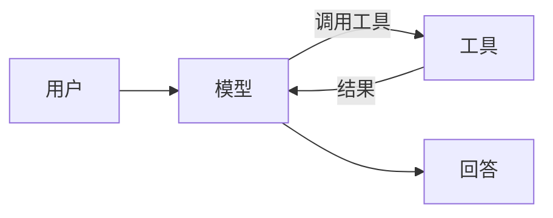

import Lead from 'stack-site-builder/components/Lead.astro';

<Lead>智能体就是一个循环：模型做判断、工具去执行、结果再回到模型。这门课从零搭出这个循环。</Lead>

## 你会做出什么 \{#what-youll-build}

一个能检索并总结的单文件智能体，并带上预算护栏。课程卡片上的难度标签（"初级"）
来自站点自己的 `difficultyLabels`。

## 前置条件 \{#prerequisites}

基础的 Python 和一个 API key。
